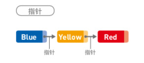
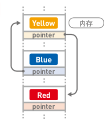
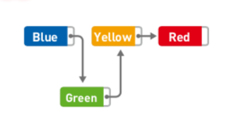
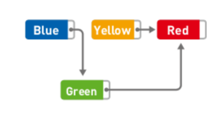

# 什么是数据结构
> 该章大量参考并使用『我的第一本算法书』中的内容，如果感兴趣的同学可以去购买该书或该书电子版查阅。

计算机存储数据时，犹如成行成列的『箱子』，每个『箱子』存储一个数据,**决定了数据存储的顺序和位置关系的便是【数据结构】**。

# 如何选择数据结构 - 电话薄的设计
现在大家都用手机，存储和查询电话号码十分方便。一个电话薄看似简单，这里面也能映射出选择合适的数据结构的重要性。

### 方式一：顺次添加
当我们有一个纸质电话薄，在得到一个新号码时，只能从上往下记录，这种方式对写一条新数据来说十分方便，例如：

name|tel
---|---|
Jack|123xxx
Emma|456xxx
Colin|789xxx
Leon|132xxx
ChaoChao|132xxx
...|...

假如我们要给『Tommy』打电话，在上面的排序中，我们不知道Tommy具体在哪，只能从上往下翻，胆子野一些说不定『随机查找』更快些。但是无论怎样，当这种存储很大时，我们找起电话来就不容易了。

### 方式二：按姓名首字母排序
无论中文名还是英文名，我们都可以找到其首字母。如果以联系人姓名首字母排序，数据都会是以字典顺序排列的，他们就是有『结构』的，例如：

name|tel
---|---|
ChaoChao|132xxx
Colin|789xxx
Emma|456xxx
Jack|123xxx
Leon|132xxx
...|...

这时，如果我们要给『Tommy』打电话，就可以很轻松确认Tommy的大致位置。

但是，如果我们要添加一条数据呢？比如我们新认识一个朋友『Fred』，要将他的手机号写到电话薄里。由于我们的电话薄是按照姓名首字母排序的，所以需要将其写在`Emma`和`Jack`的中间，但是上面已经没有空位可以写，所以需要将`Jack`的『内容写到下一行，并清空本行』，相对应的，后面所有的数据都要执行『将本行内容写到下一行，并清空本行』的操作。如果一次操作耗时10s，当我们的电话薄很大时，添加一个人进来可能要花费好几个小时。

### 方式三：将顺序添加和按首字母排序结合
通过上面的研究，我们发现：
* 顺序添加方式的新增速度快、成本小
* 按首字母排序方式的查询速度快

如果我们将电话薄分成多个部分呢？我们将每一个部分记为一个表，每一个表对应一个首字母：表A、表B、
表C... 例如：

**表C**

name|tel
---|---|
ChaoChao|132xxx
Colin|789xxx
...|...

**表E**

name|tel
---|---|
Emma|456xxx
Elin|256xxx
Elfa|356xxx
...|...

**表J**

name|tel
---|---|
Jack|123xxx
Jonny|632xxx
...|...

这样一来，我们每次添加新数据就可以找到对应的表往后面顺序写就行了，而查询时也可以快速定位到大概位置。

虽说各个表中的存储还是无规律的，每次都要从表头开始往下查找，但是也要比从整个电话薄中查找要快得多了！

# 几种基本的数据结构
> 图引自『我的第一本算法书』第一章

## 1.链表

### 概念图
如下图，`Blue`、`Yellow`、`Red`三个字符串存储于链表中，每个数据都有一个『指针』，它指向下一个数据的内存地址（`Red`是最后一个数据，其指针不指向任何位置）。

### 在内存中存储
由上述内容可知，在链表中，数据无需存储在连续空间内，一般都是分散存储的。

### 访问方式 - 顺序访问
因为数据是分散存储的，所以想要访问一个数据，只能从第一个数据开始，顺着指针往下找。比如，想查找`Red`，查找顺序如下：

`Blue` -> `Yellow` -> `Red`（Done）

查找数据的耗时和链表长度`n`有关，时间复杂度为：

    O(n)

### 添加数据
如果想添加数据，只需改变添加位置前后的指针指向即可，比如『在`Blue`和`Yellow`直接添加`Green`』：

添加数据的耗时和链表长度`n`无关，如果已经到达需要添加数据的位置，则时间复杂度为：

    O(1)

### 删除数据
删除数据也一样，我们只需要改变指针的指向即可，比如『删除`Yellow`』：

此时，`Yellow`本身还存在，不过没关系，它已经无法被访问，今后需要用到其所在存储空间时，直接覆盖掉即可。

和『添加数据』一样，删除数据的时间复杂度为：

    O(1)

### 特点
由上述内容我们可以看出，链表有以下特点：
* 数据呈线性排列
* 访问比较耗时
* 数据的添加和删除都比较方便

## 2.数组
## 3.栈
## 4.堆
## 5.队列
## 6.哈希
## 7.二叉树
